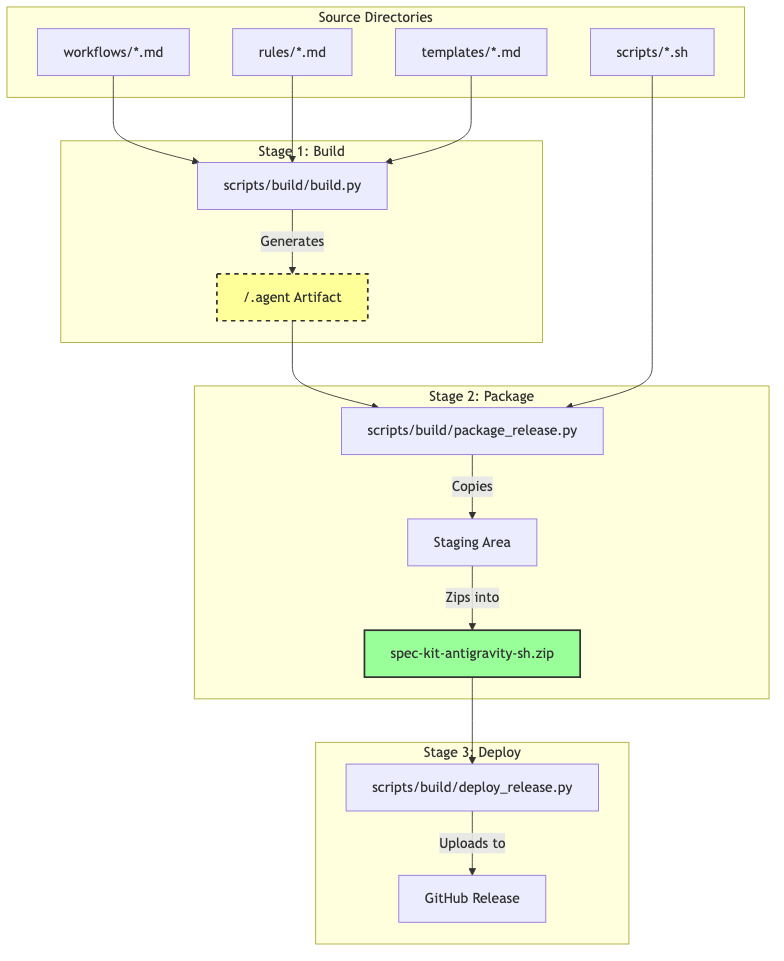

# Antigravity Release Process

This document outlines the architecture and workflow for building, packaging, and releasing the **Spec-Kit for Antigravity** fork.

## Architecture

This repository uses a **Source vs Artifact** distinction to maintain a clean codebase while providing a fully-integrated distribution for the `specify` CLI.

### Source Directories (Root)
These are the files you edit directly:

*   **`workflows/`**: Agent behavior definitions (Markdown). Converted from legacy TOML commands.
*   **`rules/`**: Constitution and agent context templates (Passive Guardrails). Note: Source folder is `memory/`, mapped to `.agent/rules/`.
*   **`scripts/`**: Bash/PowerShell scripts (e.g., `check-prerequisites.sh`). Kept in root for easy access by manual users.
*   **`templates/`**: Project file templates (e.g., `spec-template.md`). Mapped to `.agent/templates/`.

### Build Artifacts
These are generated files:

*   **`.agent/`**: A consolidated folder containing all workflows, rules, and templates. **This folder is generated by `build.py`.**
*   **`dist_output/`**: Contains the release ZIP files (`spec-kit-template-antigravity-sh.zip`).

## Workflow Diagram



## Commands

### 1. Build
Generates the `.agent` folder from source directories. Run this locally to update your agent context for testing.

```bash
python3 scripts/build/build.py --clean
```

### 2. Package
Creates the release ZIPs in `dist_output/`. Automatically runs `build.py` first to ensure freshness.

```bash
python3 scripts/build/package_release.py
```

### 3. Deploy
Uploads the ZIPs to a new GitHub Release.

```bash
python3 scripts/build/deploy_release.py --tag v0.0.1 --title "Initial Release"
```
